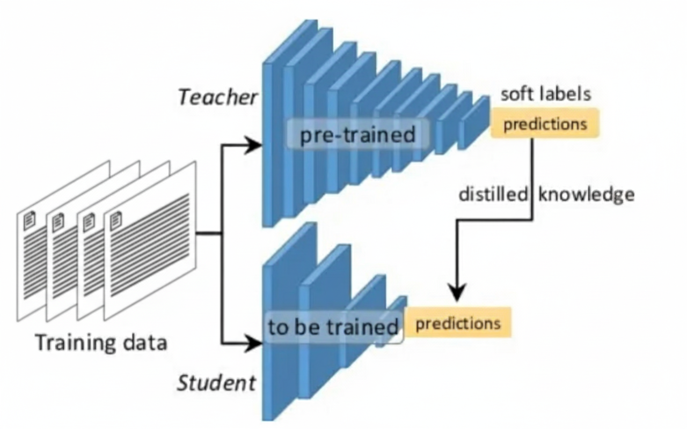

# Knowledge Distillation Project

## Overview

This project implements knowledge distillation techniques using TorchTune to transfer knowledge from larger teacher models to smaller student models. The repository contains configurations and notebooks for training smaller, more efficient models while preserving the performance of larger models.

## Project Structure

- **Notebooks**: Jupyter notebooks for knowledge distillation experiments
- **Configurations**: YAML files for different model configurations and training setups
  - `8B_lora_single_device.yaml`: Configuration for 8B parameter model with LoRA
  - `8B_to_1B_KD_lora_single_device.yaml`: Knowledge distillation setup from 8B to 1B model with LoRA

## Features

- Knowledge distillation from 8B to 1B parameter models
- LoRA (Low-Rank Adaptation) support for efficient fine-tuning
- Single-device training configurations
- TorchTune integration for streamlined model training

## Getting Started

1. Install required dependencies
2. Configure your training parameters in the YAML files
3. Run the knowledge distillation experiments using the provided notebooks

## Reference

For a detailed practical implementation guide on knowledge distillation from 8B to 1B models, see: [Teaching a 1B model think like an 8B model using Knowledge Distillation — Practical implementation guide](https://thinkinbytes.medium.com/teaching-a-1b-model-think-like-an-8b-model-using-knowledge-distillation-practical-implementation-e3a45c9b5e04)
